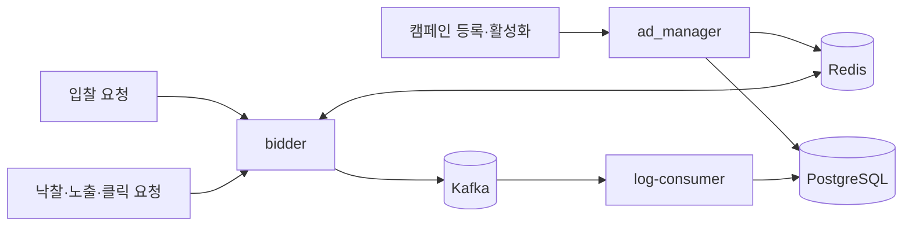

# my-rtb

실시간 광고 입찰과 예산 예약 흐름을 구현한 학습 프로젝트입니다. 캠페인을 등록·활성화하고, 입찰 요청에 맞는 광고의 예산을 예약합니다. 낙찰 통지가 오면 예약을 확정하며, 입찰·낙찰·노출·클릭 이벤트를 Kafka로 전달해 PostgreSQL에 저장합니다.

## 구성

| 구성 요소 | 역할 | 주요 기술 |
| --- | --- | --- |
| `ad_manager` | 캠페인 생성, 활성화·비활성화, PostgreSQL 저장과 Redis 입찰용 데이터 동기화 | Spring MVC, JPA, PostgreSQL, Redis |
| `bidder` | 입찰 요청 처리, 예산 예약·확정·환불, 낙찰·노출·클릭 처리 | Spring WebFlux, Reactor, Redis, Kafka |
| `log-consumer` | Kafka 이벤트 저장과 처리 실패 재시도·DLT 라우팅 | Spring Kafka, Avro, JPA |
| `docker-compose.yml` | 세 애플리케이션과 PostgreSQL, Redis, Kafka, Schema Registry의 로컬 실행 | Docker Compose |



## 현재 구현된 흐름

1. `POST /api/campaigns`로 캠페인, 타겟, 소재를 PostgreSQL에 저장합니다. 생성 직후 캠페인은 비활성 상태입니다.
2. `PATCH /api/campaigns/{campaignId}/activate`가 캠페인을 활성화하고 Redis의 캠페인 데이터와 예산 키를 준비합니다. 비활성화 API는 입찰 대상 목록에서 해당 ID를 제거합니다.
3. `POST /dsp/bid`는 기간, 최저 입찰가, OS·국가·나이, 소재 크기를 기준으로 캠페인을 거릅니다. 적합한 캠페인을 목표 CPM 내림차순으로 정렬하고, 순서대로 Redis 예산 예약을 시도합니다. 예약에 성공한 첫 캠페인으로 응답하며, 후보가 없으면 `204 No Content`를 반환합니다.
4. 응답의 `winUrl`과 광고 마크업에 포함된 URL은 내부 `auctionId`를 사용합니다. Redis 추적 정보로 원래 요청 ID, 캠페인 ID, 소재 ID를 후속 이벤트와 연결합니다.
5. `/dsp/win`은 예약 예산을 확정합니다. `/dsp/imp`는 노출 이벤트를 만들고, `/dsp/redirect`는 클릭 이벤트를 만든 뒤 소재의 클릭 URL로 리다이렉트합니다.
6. `bidder`가 네 종류의 이벤트를 Kafka에 발행하고, `log-consumer`가 각 토픽을 소비해 PostgreSQL에 저장합니다.

## 작업하며 선택한 방식

아래는 현재 코드와 커밋 이력에서 확인되는 선택입니다.

결정에 이르기까지의 작업 과정과 검토한 대안은 [프로젝트 작업 이력과 설계 결정](project-history-and-decisions.md)에 정리했습니다.

| 주제 | 현재 선택과 근거 |
| --- | --- |
| 서비스 분리 | 캠페인 관리, 실시간 입찰, 이벤트 저장을 별도 애플리케이션으로 나눴습니다. `bidder`는 도메인·포트·어댑터 구조를 사용합니다. |
| 금액 표현 | 입찰가와 예산 계산에는 소수 오차를 피하기 위해 `long`의 micro 단위를 사용합니다. 캠페인의 1회 노출 예약 금액은 목표 CPM을 1,000으로 나눈 값입니다. |
| 캠페인 선정 | 적합성 검사 후 CPM이 높은 순으로 예약을 시도합니다. 상위 캠페인의 예산 예약이 실패하면 다음 후보를 시도합니다. |
| 예산 동시성 | Redis Lua 스크립트로 예약 시 잔액 확인·차감·예약 정보 생성을 한 번에 처리합니다. 낙찰 시 예약을 확정하고, 30초 예약 키가 만료되면 Redis 키 만료 이벤트를 받아 환불합니다. |
| 생성과 집행 분리 | 캠페인 생성은 DB 저장까지만 수행하고, 활성화 API가 입찰용 Redis 데이터를 준비합니다. DB 상태 변경 후 Redis 동기화가 실패하면 DB 상태를 되돌리는 보상 처리가 있습니다. |
| 이벤트 연결 | 내부 `auctionId`를 발급해 낙찰·노출·클릭 URL과 Kafka 이벤트의 연결 키로 사용합니다. Redis 추적 정보의 TTL은 1시간입니다. |
| 이벤트 포맷과 실패 처리 | Kafka 이벤트는 Avro와 Schema Registry를 사용합니다. `log-consumer`는 공통 재시도·DLT 설정을 사용하고, DLT 로그에 원본 토픽·오프셋·예외·`auctionId` 등을 남깁니다. |

## 로컬 실행

Docker Compose가 필요합니다. 저장소 루트에서 다음 명령을 실행합니다.

```bash
docker compose up --build
```

기본 호스트 포트는 캠페인 관리 `8088`, 입찰 서버 `8080`, PostgreSQL `5432`, Redis `6379`, Kafka `9092`, Schema Registry `8081`입니다. 애플리케이션별 설정은 각 모듈의 `src/main/resources/application.yml`에 있고, Compose 환경 변수는 `docker-compose.yml`에 있습니다.

### API 예시

캠페인을 만든 뒤 응답의 `id`로 활성화합니다.

```bash
curl -X POST http://localhost:8088/api/campaigns \
  -H 'Content-Type: application/json' \
  -d '{
    "name": "sample-campaign",
    "targetCpm": 1000,
    "budget": 10000,
    "startDate": "2026-01-01",
    "endDate": "2027-12-31",
    "target": {"os": null, "country": null, "minAge": null, "maxAge": null},
    "creative": {
      "name": "sample-creative",
      "imageUrl": "https://example.com/ad.png",
      "clickUrl": "https://example.com",
      "width": 300,
      "height": 250
    }
  }'

curl -X PATCH http://localhost:8088/api/campaigns/{campaignId}/activate

curl -X POST http://localhost:8080/dsp/bid \
  -H 'Content-Type: application/json' \
  -d '{
    "id": "request-1",
    "imp": {"bidFloor": 500, "placementId": "placement-1", "width": 300, "height": 250},
    "device": {"ip": "127.0.0.1", "country": "KR", "os": "Android"},
    "user": {"age": 30}
  }'
```

`{campaignId}`는 실제 생성 응답의 ID로 바꿔야 합니다. 이 예시의 날짜와 URL은 로컬 흐름을 살펴보기 위한 샘플입니다.

### 테스트

각 모듈은 독립적인 Gradle 프로젝트입니다. Docker를 사용하는 Testcontainers 기반 테스트가 포함되어 있습니다.

```bash
cd ad_manager && ./gradlew test
cd ../bidder && ./gradlew test
cd ../log-consumer && ./gradlew test
```

## 현재 경계와 주의 사항

- `log-consumer`의 JPA 설정은 `ddl-auto: create`입니다. 기존 데이터가 필요한 PostgreSQL DB에 연결하기 전 이 설정을 확인해야 합니다.
- 광고 응답의 낙찰·노출·클릭 URL은 현재 `localhost:8080`으로 만들어집니다. 다른 호스트에서 이 URL을 호출하는 연동은 별도 주소 설정이 필요합니다.
- 예산 만료 환불은 Redis 키 만료 알림을 사용합니다. 로컬 Compose의 `redis.conf`에는 해당 알림 설정이 포함되어 있습니다.
- 이 README는 저장소의 현재 코드와 커밋 기록을 정리한 것입니다. 처리량이나 운영 안정성 수치는 여기서 검증하지 않았습니다.
